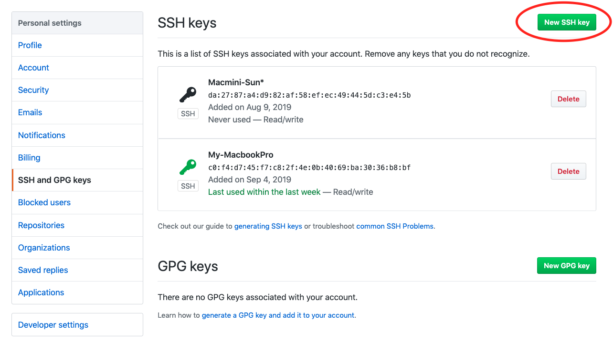
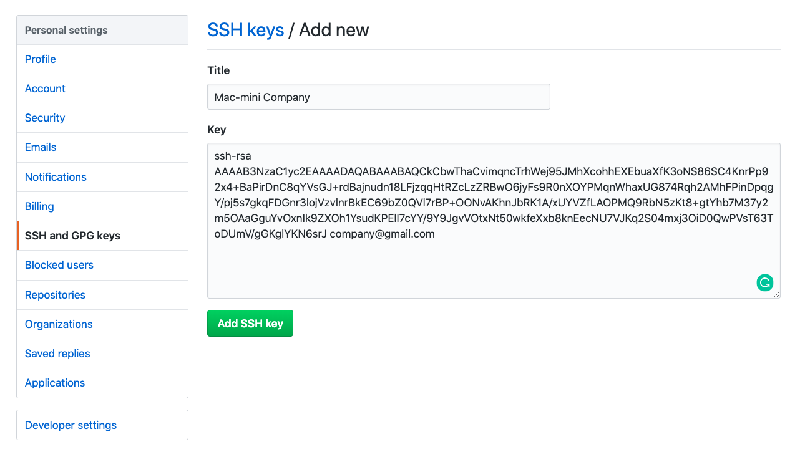

I have two git account, personal account, and company account. I'm working on one machine with several projects. Now I want to switch between the personal account and company account to do something like pushing on my personal GitHub repo. Or basically working on two account and easy to switch them every time. Here are the steps to do that:

### 1. Create new SSH key in terminal/command line
For MacOS I used
```
ssh-keygen -t rsa -C "your-email-address"
```
- **-t** stands for **'type'** and **rsa** is type of encryption
- **-C** is for comment

After enter, the result will be showing
```
Generating public/private rsa key pair.
Enter file in which to save the key (/Users/your.user.name/.ssh/id_rsa):
```

By default, if we don't type anything and hit enter, it will auto-create an id_rsa.pub file. And if we want to add more one account, we have to create another id_rsa file. For example, create id_rsa_company file:

```
/Users/your.user.name/.ssh/id_rsa_company
```

> ***Note***: Make sure you don’t override id_rsa as this is your existing key for your original account.

And next, enter a passphrase or leave it blank, then hit enter, the output will show: 

```
Enter passphrase (empty for no passphrase):
Enter same passphrase again:
Your identification has been saved in /Users/your.user.name/.ssh/id_rsa_company.
Your public key has been saved in /Users/your.user.name/.ssh/id_rsa_company.pub.
The key fingerprint is:
SHA256:cA17yhIM9rIF6Nb22wymY7yrBpZKa0k1oHWVjGnL9rc thuannvm95@gmail.com
The key's randomart image is:
+---[RSA 2048]----+
|   .+=...        |
| .o.==o  +       |
|.o.=..* o o      |
|. oo*+ = o       |
| .oooo. S        |
|.=    =..        |
|=.o. o * .       |
|.+. = . E        |
|...oo+           |
+----[SHA256]-----+
```

After that, new file id_rsa_company.pub will be created in our machine, let's check by typing this command:

```
ls -la ~/.ssh
```
By doing that, all of the SSH keys have been shown:
```
drwx------  10 your.user.name  1893963146   320 Sep  6 09:20 .
drwxr-xr-x+ 43 your.user.name  1893963146  1376 Sep  6 09:25 ..
-rw-r--r--   1 your.user.name  1893963146   187 Sep  5 16:06 config
-rw-------   1 your.user.name  1893963146  1896 Aug  9 13:05 id_rsa
-rw-r--r--   1 your.user.name  1893963146   418 Aug  9 13:05 id_rsa.pub
-rw-------   1 your.user.name  1893963146  1876 Sep  6 09:20 id_rsa_company
-rw-r--r--   1 your.user.name  1893963146   402 Sep  6 09:20 id_rsa_company.pub
-rw-------   1 your.user.name  1893963146  1896 Sep  5 15:57 id_rsa_personal
-rw-r--r--   1 your.user.name  1893963146   411 Sep  5 15:57 id_rsa_personal.pub
-rw-r--r--   1 your.user.name  1893963146  1198 Sep  5 16:11 known_hosts
```

And we should be able to see our new SSH key. Both **id_rsa_company** and **id_rsa_company.pub**

- **id_rsa_company** is our private key stored on our machine.
- **id_rsa_company.pub** is the public key which we will provide GitHub with.

### 2. Add SSH and GPG keys on Github account

Open **id_rsa_company.pub** file and copy all content.

```
vim ~/.ssh/id_rsa_company.pub
```

And copy all of this
```
ssh-rsa AAAAB3NzaC1yc2EAAAADAQABAAABAQCkCbwThaCvimqncTrhWej95JMhXcohhEXEbuaXfK3oNS86SC4KnrPp92x4+BaPirDnC8qYVsGJ+rdBajnudn18LFjzqqHtRZcLzZRBwO6jyFs9R0nXOYPMqnWhaxUG874Rqh2AMhFPinDpqgY/pj5s7gkqFDGnr3lojVzvlnrBkEC69bZ0QVl7rBP+OONvAKhnJbRK1A/xUYVZfLAOPMQ9RbN5zKt8+gtYhb7M37y2m5OAaGguYvOxnIk9ZXOh1YsudKPElI7cYY/9Y9JgvVOtxNt50wkfeXxb8knEecNU7VJKq2S04mxj3OiD0QwPVsT63ToDUmV/gGKglYKN6srJ company@gmail.com
```

Or simple type:
```
pbcopy < ~/.ssh/id_rsa_company.pub
```

Access on [Github](https://github.com) and navigate to your Github account => **Settings** => **SSH and GPG keys** 



Click **New SSH key**



Give it a title and paste new generated SSH key that you've copied before.

Because we saved our key with a unique name, we need to tell SSH about it. Within the Terminal

In MacOS, type: 

```
ssh-add ~/.ssh/id_rsa_company
```

If successful, you'll see a response of **"Identity Added."**

For Windows, type:
```
git config core.sshCommand=ssh -i ~/.ssh/id_rsa_company
```

### 3. Set your repository to be pushed to GitHub with the associated account.

First, check current logged account in your machine by typing this command to show the email:

```
git config user.email
```

Or this command to show all of the infomation about logged account:

```
git config --list
```

Make sure that you're right account, or switch to another account if needed, for example:

```
git config user.name "phuongthuan"
git config user.email "phuongthuan@gmail.com"
```

### 4. Commit and Push to your repositories
```
git init
git add .
git commit -m "First commit"
git remote add origin git@github.com:your_username/test.git
git push origin master
```

